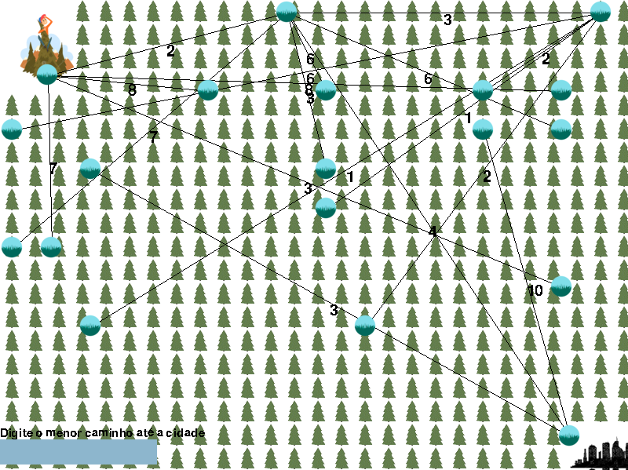

# Run away

## O que é o nosso projeto?

É um jogo, onde jogador deve adivinhar o caminho mais curto para fora da floresta para sobreviver.

## Membros:

| Nome                          | Github         | Matrícula  |
| ----------------------------- | -------------- | ---------- |
| Kathlyn Lara Murussi          | @klmurussi     | 18/0042378 |
| Júlio César Schneider Martins | @jschneiderm98 | 16/0032903 |

## Screenshots

Imagem padrão do jogo:

Imagem do usuário adivinhando a distância:

Imagem do usuário ganhando o jogo:

## Vídeo da dupla

